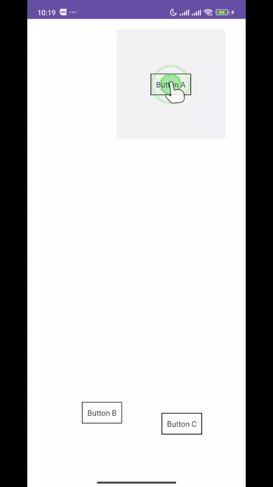
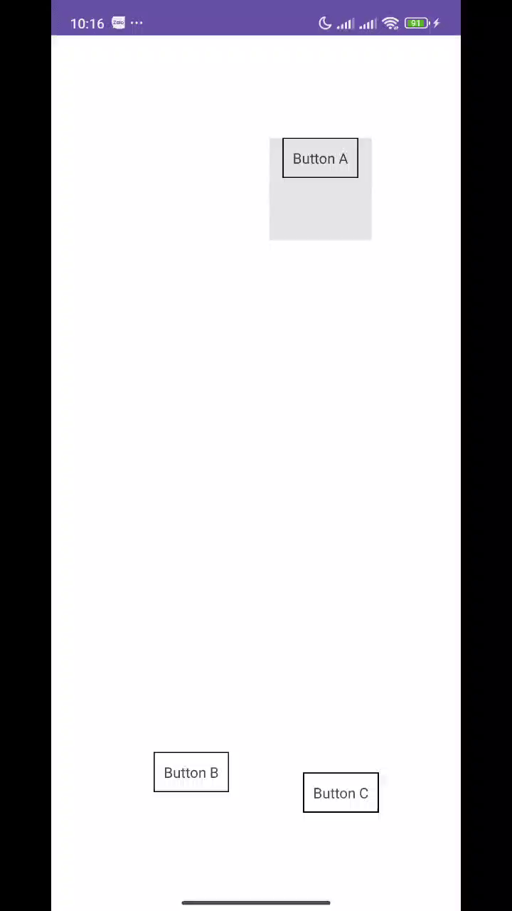

# ViewMover – Android Library

**ViewMover** giúp bạn dễ dàng **di chuyển một View** (ImageView, Button, GIF, v.v.) **từ một View nguồn (A) sang View đích (B)**, với khả năng tùy chỉnh **điểm neo (anchor)** và **điểm gắn (attach)**.

---
A lightweight Android library to move views smoothly from point A to point B using animations.
## Demo

<p align="center">
  
  
</p>

## Cài đặt (qua JitPack)

Thêm vào build.gradle (project):

```
	dependencyResolutionManagement {
		repositoriesMode.set(RepositoriesMode.FAIL-ON-PROJECT-REPOS)
		repositories {
			mavenCentral()
			maven { url = uri("https://jitpack.io") }
		}
	}
```

Thêm dependency vào build.gradle (module):

```
	dependencies {
	        implementation("com.github.minh-nguyen-2003:view-mover:1.0.0")
	}
```
## Nhớ thay 1.0.0 bằng tag release phù hợp.
## Cách sử dụng cơ bản
```kotlin
  ViewMover
    .move(binding.gifView)
    .to(binding.targetView)
    .start()
```

## Hàm khởi tạo & cài đặt
| Hàm | Ý nghĩa |
|----------------------------|-----------------------------------------------------------------------------------------------------------------------------------------------------------------|
| move(viewMove: View) | Khởi tạo một ViewMover mới với view cần di chuyển (viewMove). |
| from(viewA: View) | Chỉ định View xuất phát (nếu không dùng, mặc định xuất phát từ vị trí hiện tại). |
| to(viewB: View) | Chỉ định View đích (bắt buộc). |
| anchor(selfPoint: Point) | Chỉ định điểm neo trên viewMove (mặc định là CENTER). |
| attachTo(targetPoint: Point) | Chỉ định điểm gắn trên View đích (mặc định là CENTER). |
| duration(duration: Long) | Thời gian animation (ms). |

## Hàm bắt đầu di chuyển
| Hàm | Ý nghĩa |
|----------------------------|-----------------------------------------------------------------------------------------------------------------------------------------------------------------|
| start() | Đi từ A đến B.<br>• Nếu viewMove đang nằm trên A → di chuyển từ vị trí hiện tại.<br>• Nếu không nằm trên A → nhảy về A rồi di chuyển đến B.<br>• Nếu không có A → di chuyển từ vị trí hiện tại. |
| startSmooth() | Luôn di chuyển từ vị trí hiện tại của viewMove đến View B (bỏ qua from()). |

## Điều khiển animation
| Hàm | Ý nghĩa |
|----------------------------|-----------------------------------------------------------------------------------------------------------------------------------------------------------------|
| pause() | Tạm dừng animation (API ≥ 19). Với Android thấp hơn sẽ tự động cancel(). |
| resume() | Tiếp tục animation sau khi pause() (API ≥ 19). |

## Enum Point
ViewMover hỗ trợ 9 vị trí neo/gắn:

| Enum | Mô tả |
|----------------------------|-----------------------------------------------------------------------------------------------------------------------------------------------------------------|
| CENTER | Chính giữa |
| TOP | Mép trên, giữa |
| BOTTOM | Mép dưới, giữa |
| LEFT | Mép trái, giữa |
| RIGHT | Mép phải, giữa |
| TOP_LEFT | Góc trên trái |
| TOP_RIGHT | Góc trên phải |
| BOTTOM_LEFT | Góc dưới trái |
| BOTTOM_RIGHT | Góc dưới phải |

```kotlin
  .anchor(ViewMover.Point.TOP_LEFT)      // Neo góc trên trái của viewMove
  .attachTo(ViewMover.Point.CENTER)      // Gắn vào tâm của view đích
```

## Ví dụ hoàn chỉnh
```kotlin
  binding.btnA.setOnClickListener {
      ViewMover
          .move(binding.gifView)
          .from(binding.btnA)                      // Bắt đầu từ btnA
          .to(binding.btnB)                        // Kết thúc ở btnB
          .anchor(ViewMover.Point.TOP_LEFT)        // Neo góc trên trái gifView
          .attachTo(ViewMover.Point.CENTER)        // Gắn vào tâm của btnB
          .duration(1500)                          // 1.5 giây
          .start()
  }
  
  binding.btnB.setOnClickListener {
      ViewMover
          .move(binding.gifView)
          .to(binding.btnC)                        // Không có from() → bay từ vị trí hiện tại
          .startSmooth()
  }

```

